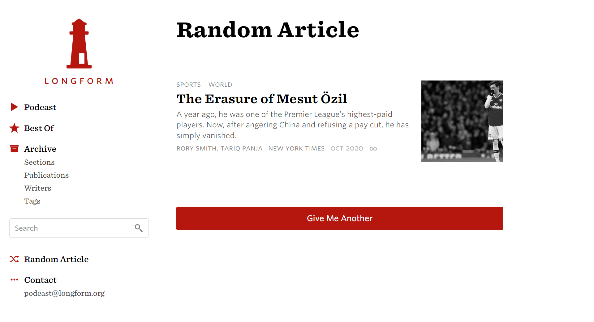
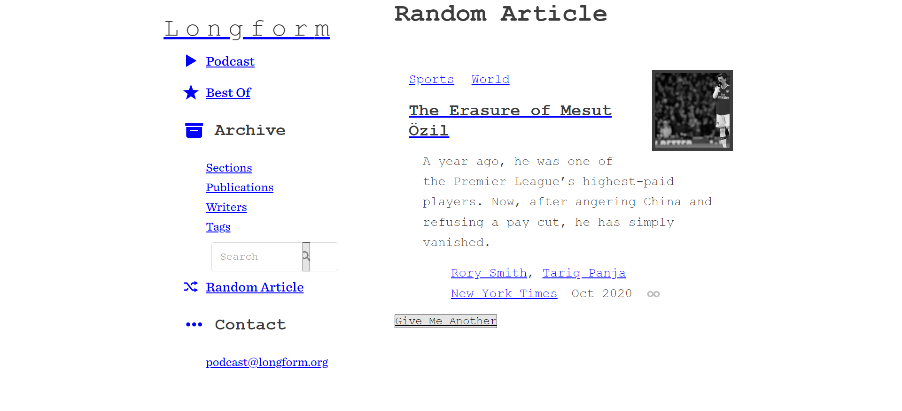

<h1 align="center">Retrify</h1>

<h3 align="center">
Chrome Extension that transforms your webpage to a retro-style site.
</h3>

Example

⬇️

## Unpack Extension in Chrome Extensions (from Google Developer Docs)

To load an unpacked extension in developer mode:

Go to the Extensions page by entering chrome://extensions in a new tab. (By design chrome:// URLs are not linkable.)

Alternatively, click the Extensions menu puzzle button and select Manage Extensions at the bottom of the menu.

Or, click the Chrome menu, hover over More Tools, then select Extensions.

Enable Developer Mode by clicking the toggle switch next to Developer mode.

Click the Load unpacked button and select the extension directory.

Once the extension is active, toggle between retro style with
 
`Ctrl+B` (or `Command+B`)
